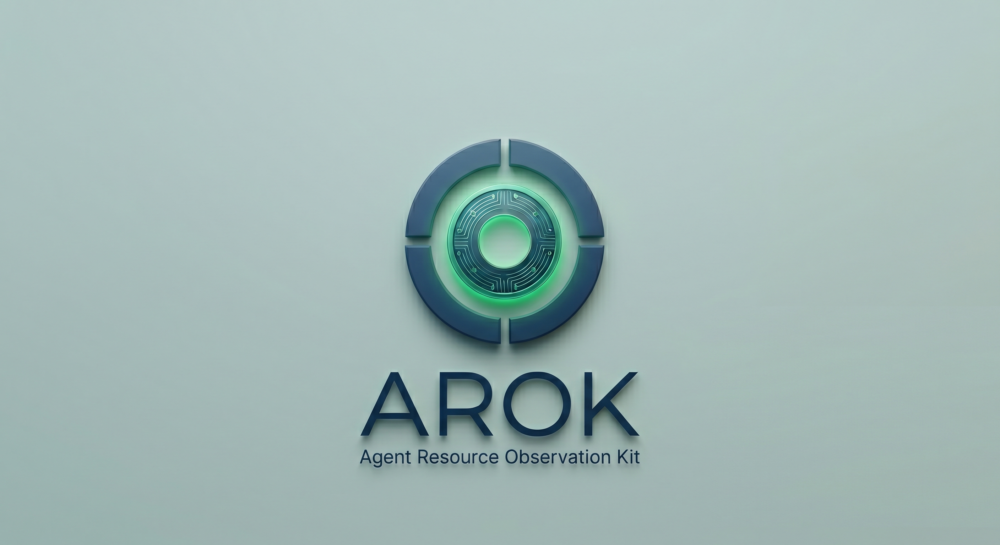

<p align="center">
  
</p>

<p align="center">
  <a href="https://github.com/srbouffard/arok/releases/latest"></a>
  <a href="https://github.com/srbouffard/arok/actions/workflows/ci.yml"></a>
  <a href="https://github.com/srbouffard/arok/actions/workflows/codeql.yml"></a>
  
  <a href="LICENSE"></a>
</p>

# arok

**Agent Resource Observation Kit** — local-first observability for AI coding tools.

`arok` captures usage from GitHub Copilot (CLI and VS Code) automatically via hooks, stores everything in a local SQLite database, and gives you per-session, per-repo, per-model breakdowns — no accounts, no telemetry, no cloud.

---

## Installation

```bash
curl -fsSL https://raw.githubusercontent.com/srbouffard/arok/main/install.sh | bash
```

Installs to `~/.local/bin`. Add to PATH if needed:

```bash
echo 'export PATH="$HOME/.local/bin:$PATH"' >> ~/.bashrc  # or ~/.zshrc
```

Then set up Copilot hooks:

```bash
arok install copilot
```

To import existing VS Code sessions:

```bash
arok capture --harness vscode --event scan
```

**Build from source** (requires Go 1.26+):

```bash
git clone https://github.com/srbouffard/arok.git && cd arok
./install.sh --from-source
```

---

## What you can measure

**Overview analytics:**

```
$ arok analyze overview --since 168h

sessions                  23
final_sessions            22
provisional_sessions       0
best_effort_sessions       1
total_input_tokens    16,950,294
total_output_tokens      167,326
total_cache_read_tokens 15,615,328
total_reasoning_tokens    45,729

top hosts
KEY                SESSIONS  INPUT      OUTPUT
sbouffard          21        16,890K    165,979
default-workspace   2             0        466

top repos
KEY                                        SESSIONS  INPUT      OUTPUT
https://github.com/myorg/api               12        8,431,205  74,312
https://github.com/myorg/frontend           7        3,102,881  28,940

top branches
KEY     SESSIONS  INPUT      OUTPUT
main    15        14,210,000  142,100
feat     8         2,740,294   25,226
```

**Usage across your repos (last 7 days):**

```
$ arok query repos --since 168h

KEY                                        SESSIONS  INPUT      OUTPUT   CACHE_READ   REASONING
https://github.com/myorg/api               12        8,431,205  74,312   7,120,450    24,193
https://github.com/myorg/frontend           7        3,102,881  28,940   2,890,120     8,421
https://github.com/myorg/infra              4          981,440  12,201     901,882         0
```

**Usage per host:**

```
$ arok query hosts

KEY                SESSIONS  INPUT      OUTPUT   CACHE_READ   REASONING
sbouffard          51        18,031,907  186,763  15,615,328   45,729
default-workspace   1                0      466           0        0
```

**Per-model breakdown:**

```
$ arok query models --since 168h

MODEL               SESSIONS  INPUT      OUTPUT   CACHE_READ   REASONING
claude-sonnet-4.6   11        11,147,009  81,011  10,180,660   15,892
gpt-5.4              5         3,976,145  59,354   3,805,696   24,833
claude-haiku-4.5     3            65,492   5,918      33,307      408
```

**Filter sessions by host, repo, or branch:**

```
$ arok query sessions --branch main --since 168h

SESSION       HARNESS         STATE  HOST       BRANCH  INPUT     OUTPUT  ENDED_AT
ae5514bb...   copilot-cli     final  sbouffard  main    16,890K   165,979  2026-06-17T04:39Z
2666a4d1...   copilot-vscode  final  sbouffard  main     24,258       368  2026-06-17T12:47Z

totals  sessions=7  input=16,950,294  output=166,860  cache_read=15,615,328  reasoning=45,729
```

Flags can be combined: `--host`, `--repo`, `--branch`, `--since` all filter the same result set.

**Recent sessions:**

```
$ arok query sessions --latest 5

SESSION       HARNESS         STATE  BRANCH  WORKTREE            INPUT     OUTPUT  ENDED_AT
ae5514bb...   copilot-cli     final  main    ~/projects/myapi    16,890K   165,979  2026-06-17T04:39Z
2666a4d1...   copilot-vscode  final  main    ~/projects/specs     24,258       368  2026-06-17T12:47Z
```

---

## Supported AI tools

| Tool | Harness | Install | Capture method |
| --- | --- | --- | --- |
| **GitHub Copilot CLI** | `copilot-cli` | `arok install copilot` | `sessionEnd` hook → `events.jsonl` |
| **GitHub Copilot VS Code** | `copilot-vscode` | `arok install copilot` | `Stop` hook + `chatSessions` JSONL |

---

## Captured metrics

**Token usage**

| Metric | CLI | VS Code |
| --- | --- | --- |
| Input tokens | ✅ | ✅ (where available) |
| Output tokens | ✅ | ✅ |
| Cache read tokens | ✅ | — |
| Cache write tokens | ✅ | — |
| Reasoning tokens | ✅ | — |
| Per-model breakdown | ✅ | ✅ |
| Interaction count | ✅ | ✅ |

**Session metadata**

| Metadata | CLI | VS Code |
| --- | --- | --- |
| Hostname | ✅ | ✅ |
| Working directory | ✅ | ✅ |
| Git remote URL | ✅ | ✅ |
| Git branch | ✅ | ✅ |
| Git commit (HEAD) | ✅ | ✅ |
| Worktree root | ✅ | ✅ |
| Session timestamps | ✅ | ✅ |

Hostname capture makes `arok` useful for **containerized or remote agent sessions** — see [Multi-host and containers](#multi-host-and-containers) below.

---

## Commands

| Command | Purpose |
| --- | --- |
| `arok install copilot` | Install Copilot hook configuration |
| `arok capture` | Ingest hook payloads (called automatically) |
| `arok reconcile` | Background reconciliation (called automatically) |
| `arok query sessions` | List recent sessions (`--host`, `--repo`, `--branch`, `--since` to filter) |
| `arok query hosts` | Usage grouped by host |
| `arok query repos` | Usage grouped by repository |
| `arok query branches` | Usage grouped by branch |
| `arok query models` | Usage grouped by model |
| `arok query worktrees` | Usage grouped by worktree |
| `arok query harnesses` | Usage grouped by harness |
| `arok analyze overview` | Aggregate analytics with per-host, per-repo, per-branch, per-model breakdowns |
| `arok doctor` | Validate installation and database health |
| `arok update` | Self-update to the latest release |
| `arok version` | Show version |

All `query` and `analyze` commands accept `--since <duration>` (e.g. `24h`, `168h`, `720h`) and `--limit N`.

---

## How it works

**Copilot CLI:** the `sessionEnd` hook fires when a session ends. arok reads the local `events.jsonl` session log, extracts token totals and per-model usage, enriches with git metadata, and writes a normalized record to SQLite. If usage metrics haven't arrived yet (the model is still reporting), a background reconcile process retries until the data lands.

**VS Code:** the `Stop` hook fires after each turn. arok replays the session's `chatSessions` JSONL patch-log to reconstruct the final state with accurate token counts, then maps the workspace folder to git context.

Both harnesses write to the same SQLite database. All query commands report across them uniformly. Resumed sessions (`--continue` / `--resume`) update the same record.

---

## State directory

Default: `${XDG_STATE_HOME:-$HOME/.local/state}/arok`

Override: `export AROK_STATE_DIR=/absolute/path`

| Path | Purpose |
| --- | --- |
| `usage.db` | SQLite database |
| `hooks/` | Generated hook configs |
| `logs/` | Capture and error logs |
| `reconcile/` | Temporary reconcile state |

---

## Multi-host and containers

Because every session records `hostname`, `arok` works naturally across multiple machines or containerized agents all writing to a shared database. You can see which host a session came from and query usage per-host.

**Setup:**

```bash
# 1. On the host — install and initialise the shared state directory
curl -fsSL https://raw.githubusercontent.com/srbouffard/arok/main/install.sh | bash
arok install copilot --state-dir /shared/arok
```

```bash
# 2. Mount /shared/arok into the container (Multipass or LXD)
multipass mount /shared/arok <instance>:/shared/arok

# or with LXD
lxc config device add <container> arok-state disk source=/shared/arok path=/shared/arok
```

```bash
# 3. Inside the container — install arok and point it at the shared state
curl -fsSL https://raw.githubusercontent.com/srbouffard/arok/main/install.sh | bash
arok install copilot --state-dir /shared/arok
```

From this point the hooks fire automatically on session end. Sessions from all containers land in a single `usage.db` on the host.

```
$ arok query sessions --latest 10

SESSION       HARNESS      HOST         BRANCH  INPUT    OUTPUT   ENDED_AT
ae5514bb...   copilot-cli  agent-1      main    8,431K   74,312   2026-06-17T04:39Z
b91f3c2a...   copilot-cli  agent-2      feat    3,102K   28,940   2026-06-17T05:12Z
d44c8e01...   copilot-cli  agent-1      main    1,201K   12,001   2026-06-17T06:03Z
```

The state directory is safe for concurrent writes — SQLite's WAL mode handles multiple writers.

---

## Development

```bash
make check    # fmt + vet + test + build
make test     # Tests only
make build    # Binary to dist/arok
```

**Design:** single Go binary, no cgo, pure-Go SQLite (`modernc.org/sqlite`), local-first.

---

## License

See LICENSE file for details.
